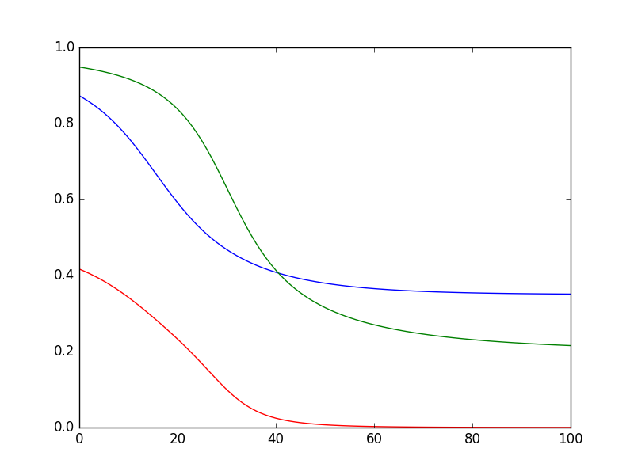

###Feed Forward Neural Networks
* [universal approximation theorem](https://en.wikipedia.org/wiki/Universal_approximation_theorem): feed forward networks with at least one hidden layer and a finite amount of neurons can fit any function 
* Mathematical description [here](neural_net.pdf)

###Training
